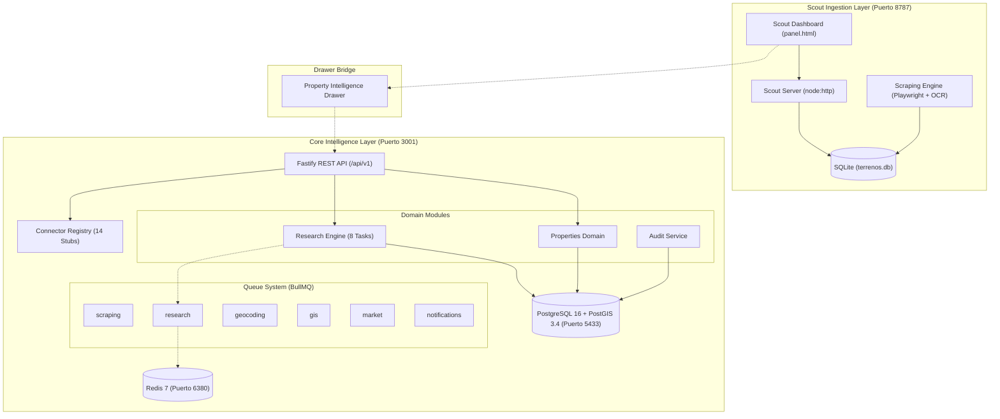

# Arquitectura del Sistema — Land Intelligence

## 1. Resumen Ejecutivo

**Land Intelligence** es una plataforma de software diseñada para transformar datos no estructurados de anuncios inmobiliarios y fuentes registrales/municipales en inteligencia accionable sobre terrenos, comenzando por Arequipa, Perú.

La arquitectura sigue el patrón **Modular Monolith** (Monolito Modular) en TypeScript, diseñado para operar en dos capas concurrentes:
1. **Scout Ingestion Layer (Legacy Scout)**: Monitorea Facebook Marketplace, Grupos, AdondeVivir y Urbania en el puerto `8787` con almacenamiento local SQLite.
2. **Core Intelligence Layer (Fastify + PostgreSQL/PostGIS)**: Centraliza la normalización, trazabilidad, análisis espacial, consultas registrales y scoring en el puerto `3001`.



---

## 2. Principios Arquitectónicos Fundamentales

### A. Monolito Modular sobre Microservicios
- Todo el núcleo vive en un solo proceso Node.js (`server/`), con módulos de dominio fuertemente cohesionados y bajo acoplamiento.
- Evita la sobrecarga operacional de microservicios, facilitando transacciones ACID, refactorizaciones y despliegues sin fricción.

### B. Coexistencia No Destructiva (Dual-Port Strategy)
- No se fuerza una migración violenta desde SQLite hacia PostgreSQL.
- El Scout existente opera de manera ininterrumpida. La sincronización hacia PostgreSQL se realiza como un pipeline de enriquecimiento aguas abajo.
- Los puertos del ERP de producción (`5432` y `6379`) están protegidos: Land Intelligence utiliza **`5433`** para Postgres y **`6380`** para Redis.

### C. Trazabilidad y Proveniencia Estricta (Data Provenance)
Ningún dato ingresa al núcleo sin saber:
- ¿De qué fuente provino? (`source`)
- ¿Cuál es la URL de origen? (`source_url`)
- ¿Cuándo fue extraído? (`retrieved_at`)
- ¿Qué nivel de certeza tiene? (`confidence`: high, medium, low, unknown)
- ¿Ha sido verificado por un humano o registro oficial? (`verification`: reported, inferred, verified, conflicting)
- ¿Cuál fue el payload crudo exacto? (`raw_data`)

### D. Preservación de Conflictos
Si una publicación de Facebook dice que un terreno mide `500 m²` pero la partida de SUNARP indica `420 m²`, el sistema **NO SOBREESCRIBE** el valor. Almacena ambos como observaciones vinculadas a la propiedad y marca el estado como `conflicting`, generando una alerta de discrepancia.

### E. Conectores Tipados y Stubs Explícitos
Todos los orígenes de datos externos implementan la interfaz `PropertyDataSource`. En Fase 1, los 14 conectores son stubs seguros que devuelven status `'unavailable'`. No existen mocks engañosos ni simulaciones que generen datos falsos.

---

## 3. Módulos del Sistema

### 1. `server/src/db/` — Capa de Persistencia
- **Drizzle ORM** con soporte completo para PostgreSQL 16 y tipos nativos PostGIS (`geometry(Point, 4326)`, `geometry(Polygon, 4326)`).
- 28 tablas relacionales y 19 tipos enum de PostgreSQL que garantizan integridad referencial estricta.

### 2. `server/src/domain/properties/` — Módulo Inmobiliario Central
- Administra el ciclo de vida de la entidad `Property` (inmueble unificado).
- Gestiona la vinculación de múltiples `PropertyListings` (anuncios en portales o redes sociales) a un único inmueble físico.

### 3. `server/src/domain/research/` — Motor de Investigación (Due Diligence)
- Administra `ResearchCase` y orquesta las **8 tareas de investigación**:
  1. Identidad y deduplicación.
  2. Geolocalización y normalización PostGIS.
  3. Consulta registral SUNARP.
  4. Base Gráfica Registral (BGR).
  5. Análisis urbanístico (IMPLA / PDM Arequipa).
  6. Antecedentes judiciales y remates (CEJ / REM@JU).
  7. Valuación de mercado y comparables.
  8. Scoring de riesgo y generación de alertas.

### 4. `server/src/connectors/` — Capa de Integraciones Externas
- `ConnectorRegistry`: registro dinámico de adaptadores.
- Stubs implementados: SUNARP (Conoce Aquí, BGR, SPRL), REM@JU, Google Maps, OpenStreetMap, IMPLA, PDM, Municipalidades, Catastro, Poder Judicial CEJ, SBN, COFOPRI, SEACE.

### 5. `server/src/workers/` — Infraestructura Asíncrona (BullMQ)
- 6 colas de trabajo preparadas para procesar tareas pesadas en segundo plano:
  - `scraping`: Recolección periódica y bajo demanda.
  - `research`: Ejecución de casos de investigación.
  - `geocoding`: Transformación de direcciones textuales en coordenadas.
  - `gis`: Intersecciones espaciales con zonificación PDM.
  - `market`: Cálculo de comparables y valuación.
  - `notifications`: Envío de alertas críticas.

---

## 4. Flujo de Datos

```text
[Anuncio en Facebook / Portales]
            │
            ▼
[Scout Engine (Playwright + OCR)] ──► [SQLite: data/terrenos.db]
            │
            ▼ (Sincronización o clic en "Investigar")
[Fastify API: POST /api/v1/properties/:id/research]
            │
            ├──► Crea registro en "research_cases"
            ├──► Encola 8 tareas en "research_tasks"
            │       ├── 1. Identity Task
            │       ├── 2. Geolocation Task (PostGIS)
            │       ├── 3. SUNARP Registry Task
            │       ├── 4. BGR Overlay Task
            │       ├── 5. IMPLA / PDM Urban Task
            │       ├── 6. Judicial CEJ Task
            │       ├── 7. Market Valuation Task
            │       └── 8. Risk Scoring Task
            ▼
[Normalización y Almacenamiento en PostgreSQL 16 + PostGIS]
            │
            ▼
[Property Intelligence Drawer en Panel Web]
```
