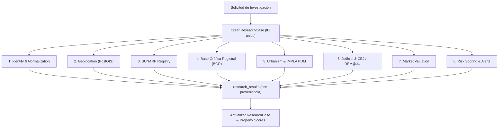

# Motor de Investigación (Research Engine) — Due Diligence Automatizado

## 1. Visión del Motor

El **Research Engine** es el componente central de Land Intelligence que transforma un simple anuncio inmobiliario en un **expediente integral de due diligence territorial**.

Cuando el usuario hace clic en **[INVESTIGAR]** en el panel o se dispara una orden vía API (`POST /api/v1/properties/:id/research`), el motor crea un `ResearchCase` y programa automáticamente **8 tareas especializadas** que se ejecutan en segundo plano.

---

## 2. Las 8 Tareas de Investigación

### Tarea 1: Identidad y Normalización (`identity`)
- **Objetivo**: Limpiar datos textuales, calcular `content_hash`, detectar número de teléfono de contacto y normalizar precios a USD y PEN.
- **Entrada**: Datos crudos de la publicación.
- **Salida**: Inmueble enriquecido y deduplicado.
- **Prioridad**: `critical`.

### Tarea 2: Geolocalización & PostGIS (`geolocation`)
- **Objetivo**: Extraer indicios de ubicación (dirección, distrito real, referencias, coordenadas GPS si existen) y convertirlos en un punto espacial `geometry(Point, 4326)` en la tabla `property_geometries`.
- **Entrada**: Título, descripción, ubicación reportada por la plataforma y datos de OCR.
- **Salida**: Coordenadas validadas, distrito real verificado y polígono aproximado.
- **Prioridad**: `critical`.

### Tarea 3: Verificación Registral SUNARP (`registry`)
- **Objetivo**: Búsqueda en el índice de predios de SUNARP (Zona Registral N° XII - Sede Arequipa) para localizar la partida electrónica, titular registral y verificar si existen cargas o gravámenes inscritos.
- **Entrada**: DNI/RUC del vendedor, nombre del titular o número de partida si fue mencionado en el anuncio.
- **Salida**: Registro en `registry_properties`, `registry_owners` y `registry_charges`.
- **Prioridad**: `high`.

### Tarea 4: Base Gráfica Registral (`bgr`)
- **Objetivo**: Consultar la cartografía registral de SUNARP para verificar la existencia del polígono del predio en la base gráfica y descartar superposiciones de partidas o linderos superpuestos.
- **Entrada**: Coordenadas geográficas y partida electrónica.
- **Salida**: Polígono oficial SUNARP y reporte de superposición.
- **Prioridad**: `high`.

### Tarea 5: Urbanismo & Zonificación IMPLA / PDM (`urbanism`)
- **Objetivo**: Cruzar la ubicación espacial del inmueble con las capas cartográficas del Plan de Desarrollo Metropolitano (PDM) de Arequipa y el Instituto Municipal de Planeamiento (IMPLA).
- **Entrada**: Coordenadas PostGIS.
- **Salida**: Zonificación oficial (RDM, RDA, CZ, ZRE, Agrícola, etc.), retiros reglamentarios, altura máxima de edificación y usos compatibles.
- **Prioridad**: `medium`.

### Tarea 6: Verificación Judicial & CEJ (`judicial`)
- **Objetivo**: Consultar la plataforma de Consulta de Expedientes Judiciales (CEJ) de la Corte Superior de Justicia de Arequipa y la plataforma REM@JU para verificar si el predio o sus propietarios tienen litigios por usurpación, desalojo, mejor derecho de propiedad o remates judiciales activos.
- **Entrada**: Nombres de titulares registrales y dirección del predio.
- **Salida**: Registros en `judicial_cases` y `judicial_events`.
- **Prioridad**: `high`.

### Tarea 7: Valuación y Comparables de Mercado (`market`)
- **Objetivo**: Analizar precios de terrenos en la misma zona o distrito dentro de un radio de 500m a 2km para calcular el valor promedio por m² y detectar si la publicación está bajo o sobre el precio de mercado.
- **Entrada**: Distrito, área en m², coordenadas y tipo de terreno.
- **Salida**: Registros en `market_comparables` y estimación en `market_prices`.
- **Prioridad**: `medium`.

### Tarea 8: Scoring de Riesgo & Alertas (`risk`)
- **Objetivo**: Consolidar los resultados de las 7 tareas previas y emitir una matriz de alertas automatizadas.
- **Alertas Típicas**:
  - *Discrepancia de área*: El anuncio afirma 500 m², pero la partida SUNARP indica 380 m².
  - *Riesgo de estafa*: El predio se ubica en zona de riesgo no mitigable según el PDM (torrenteras, quebradas volcánicas).
  - *Propiedad estatal*: El predio intersecta con terrenos inscritos a nombre del Estado (SBN/COFOPRI).
  - *Oportunidad de precio*: Precio por m² 35% inferior a la media del distrito.
- **Prioridad**: `critical`.

---

## 3. Manejo de Acciones Manuales (`requires_manual_action`)

No todas las fuentes en el Perú están 100% digitalizadas o libres de CAPTCHAs. Cuando un conector no puede resolver automáticamente una consulta (ej. requiere comprar una copia literal en SPRL o resolver un captcha complejo de SUNARP), la tarea cambia a estado:
`task.status = 'requires_manual_action'`
`task.manual_action_description = 'Se requiere adquirir copia literal de la partida 11029384 en SUNARP SPRL'`

Esto permite que un analista humano suba el documento o ingrese el dato, sin bloquear el resto del pipeline.
