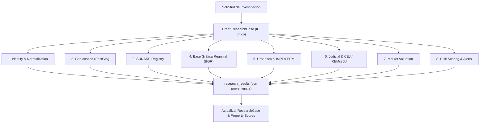

# Motor de Investigación (Research Engine) — Due Diligence Automatizado

## 1. Visión del Motor

El **Research Engine** es el componente central de Land Intelligence que transforma un simple anuncio inmobiliario en un **expediente integral de due diligence territorial**.

Cuando el usuario hace clic en **[INVESTIGAR]** en el panel o se dispara una orden vía API (`POST /api/v1/properties/:id/research`), el motor crea un `ResearchCase` y programa automáticamente **8 tareas especializadas** que se ejecutan en segundo plano.

---

## 2. Las 8 Tareas de Investigación



### Tarea 1: Identidad y Normalización (`identity`)
- **Objetivo**: Limpiar datos textuales, calcular `content_hash`, detectar número de teléfono de contacto y normalizar precios a USD y PEN.
- **Entrada**: Datos crudos de la publicación.
- **Salida**: Inmueble enriquecido y deduplicado.
- **Prioridad**: `critical`.

### Tarea 2: Geolocalización & PostGIS (`geolocation`)
- **Objetivo**: Extraer indicios de ubicación (dirección, distrito real, referencias, coordenadas GPS si existen) y convertirlos en un punto espacial `geometry(Point, 4326)` en la tabla `property_geometries`.
- **Entrada**: Título, descripción, ubicación reportada por la plataforma y datos de OCR.
- **Salida**: Coordenadas validadas, distrito real verificado y polígono aproximado.
- **Prioridad**: `critical`.

### Tarea 3: Verificación Registral SUNARP (`registry`)
- **Objetivo**: Búsqueda en el índice de predios de SUNARP (Zona Registral N° XII - Sede Arequipa) para localizar la partida electrónica, titular registral y verificar si existen cargas o gravámenes inscritos.
- **Entrada**: DNI/RUC del vendedor, nombre del titular o número de partida si fue mencionado en el anuncio.
- **Salida**: Registro en `registry_properties`, `registry_owners` y `registry_charges`.
- **Prioridad**: `high`.

### Tarea 4: Base Gráfica Registral (`bgr`)
- **Objetivo**: Consultar la cartografía registral de SUNARP para verificar la existencia del polígono del predio en la base gráfica y descartar superposiciones de partidas o linderos superpuestos.
- **Entrada**: Coordenadas geográficas y partida electrónica.
- **Salida**: Polígono oficial SUNARP y reporte de superposición.
- **Prioridad**: `high`.

### Tarea 5: Urbanismo & Zonificación IMPLA / PDM (`urbanism`)
- **Objetivo**: Cruzar la ubicación espacial del inmueble con las capas cartográficas del Plan de Desarrollo Metropolitano (PDM) de Arequipa y el Instituto Municipal de Planeamiento (IMPLA).
- **Entrada**: Coordenadas PostGIS.
- **Salida**: Zonificación oficial (RDM, RDA, CZ, ZRE, Agrícola, etc.), retiros reglamentarios, altura máxima de edificación y usos compatibles.
- **Prioridad**: `medium`.

### Tarea 6: Verificación Judicial & CEJ (`judicial`)
- **Objetivo**: Consultar la plataforma de Consulta de Expedientes Judiciales (CEJ) de la Corte Superior de Justicia de Arequipa y la plataforma REM@JU para verificar si el predio o sus propietarios tienen litigios por usurpación, desalojo, mejor derecho de propiedad o remates judiciales activos.
- **Entrada**: Nombres de titulares registrales y dirección del predio.
- **Salida**: Registros en `judicial_cases` y `judicial_events`.
- **Prioridad**: `high`.

### Tarea 7: Valuación y Comparables de Mercado (`market`)
- **Objetivo**: Analizar precios de terrenos en la misma zona o distrito dentro de un radio de 500m a 2km para calcular el valor promedio por m² y detectar si la publicación está bajo o sobre el precio de mercado.
- **Entrada**: Distrito, área en m², coordenadas y tipo de terreno.
- **Salida**: Registros en `market_comparables` y estimación en `market_prices`.
- **Prioridad**: `medium`.

### Tarea 8: Scoring de Riesgo & Alertas (`risk`)
- **Objetivo**: Consolidar los resultados de las 7 tareas previas y emitir una matriz de alertas automatizadas.
- **Alertas Típicas**:
  - *Discrepancia de área*: El anuncio afirma 500 m², pero la partida SUNARP indica 380 m².
  - *Riesgo de estafa*: El predio se ubica en zona de riesgo no mitigable según el PDM (torrenteras, quebradas volcánicas).
  - *Propiedad estatal*: El predio intersecta con terrenos inscritos a nombre del Estado (SBN/COFOPRI).
  - *Oportunidad de precio*: Precio por m² 35% inferior a la media del distrito.
- **Prioridad**: `critical`.

---

## 3. Manejo de Acciones Manuales (`requires_manual_action`)

No todas las fuentes en el Perú están 100% digitalizadas o libres de CAPTCHAs. Cuando un conector no puede resolver automáticamente una consulta (ej. requiere comprar una copia literal en SPRL o resolver un captcha complejo de SUNARP), la tarea cambia a estado:
`task.status = 'requires_manual_action'`
`task.manual_action_description = 'Se requiere adquirir copia literal de la partida 11029384 en SUNARP SPRL'`

Esto permite que un analista humano suba el documento o ingrese el dato, sin bloquear el resto del pipeline.

---

## 4. Ciclo de Vida del ResearchCase (Fase 3 / T3.1)

El estado del caso se modela en `server/src/domain/research/lifecycle.ts` y vive en la columna `research_cases.status` (enum PostgreSQL `research_status`).

```text
created ──▶ queued ──▶ running ──┬──▶ completed
   │          │          │        ├──▶ partial
   └──────────┴──────────┘        └──▶ failed
                                 (cancelled disponible)
```

Estados:

- **created**: el caso se creó junto con sus 8 tareas; aún no se encoló nada.
- **queued**: al menos un job (geocoding o research) fue encolado en BullMQ.
  Si Redis está caído no se encola nada y el caso permanece en `created`.
- **running**: el worker de research toma el caso y registra `startedAt`.
- **completed**: todas las tareas llegaron a estado terminal y ninguna falló.
- **partial**: todas las tareas terminaron, pero al menos una falló (una fuente
  caída no deja el caso colgado en `running`).
- **failed**: el procesamiento del caso lanzó un error no recuperable.
- **cancelled**: reservado para cancelación explícita.

Reglas de integridad:

- Las transiciones se validan con `assertCaseTransition()` y se aplican con
  `transitionCase()` mediante un `UPDATE ... WHERE status = <estado actual>`,
  por lo que son **race-safe** y **atómicas**.
- Los estados terminales (`completed`, `partial`, `failed`, `cancelled`) son
  **inmutables**: el worker omite casos ya terminados (idempotencia ante
  re-entregas de BullMQ).
- `startedAt` se fija al entrar en `running`; `completedAt` y `summary` al
  alcanzar un estado terminal.
- `errorCount` = número de tareas `failed`.
- `warningCount` = tareas `requires_manual_action` + `blocked` + `unavailable`.
- `pending` se conserva como estado legacy de filas anteriores a T3.1; las
  nuevas cases nacen en `created`.

---

## 5. Ciclo de Vida del ResearchTask (Fase 3 / T3.2)

El estado de cada tarea se modela en `server/src/domain/research/task-lifecycle.ts`
y vive en la columna `research_tasks.status` (enum PostgreSQL `task_status`).

```text
               ┌──▶ completed (éxito)
               ├──▶ failed (error / reintentos agotados)
pending ──▶ running ──▶ requires_manual_action (pausa → running/completed)
   │           ├──▶ unavailable (fuente externa no accesible)
   │           ├──▶ blocked (bloqueado por otra tarea/estado)
   │           └──▶ skipped (no aplica / ya resuelto por otro camino)
   │
   └──▶ completed / failed / requires_manual_action /
        unavailable / blocked / skipped (sin pasar por running)
```

Estados (enum `task_status`):

- **pending**: creada junto con el caso; a la espera de un worker.
- **running**: un worker la tomó en ejecución (`startedAt`).
- **completed**: resultado obtenido y registrado (con `resultReference` cuando
  aplica). Estado **inmutable**.
- **failed**: el intento falló (p. ej. geolocalización sin resultados).
- **requires_manual_action**: el trabajo quedó pausado esperando acción humana
  (CAPTCHA, login, pago, dato manual). `requiresManualAction = true` con
  `manualActionDescription`. No se marca `completedAt` porque no terminó.
- **blocked**: bloqueada por una dependencia no disponible.
- **unavailable**: el conector externo es un stub o no está accesible
  (política anti-datos-inventados).
- **skipped**: no aplica o ya fue resuelta por otra ejecución (geolocalización
  idempotente). Estado **inmutable**.

Reglas de integridad:

- Las transiciones se validan con `assertTaskTransition()` y se aplican con
  `transitionTask()` mediante un `UPDATE ... WHERE status = <estado actual>`,
  por lo que son **race-safe** y **atómicas** (mismo patrón que el caso).
- **Inmutables**: `completed` y `skipped` nunca cambian.
- **Reintentables**: `failed`, `blocked`, `unavailable` y
  `requires_manual_action` pueden volver a `pending`/`running`
  (re-ejecución), lo que invalida `completedAt`, re-abre `startedAt` cuando
  aplica y **suma 1 a `retryCount`** hasta `maxRetries`.
- `startedAt` se fija al entrar en `running`, o al alcanzar un estado final sin
  haber pasado por `running` (ventana de trabajo implícita). `completedAt` se
  fija al concluir el trabajo automatizado (nunca en `requires_manual_action`).
- `completed` limpia `error` y `requiresManualAction`; `requires_manual_action`
  activa automáticamente el flag `requiresManualAction`.
- **Settled** (para decidir el estado del caso): `completed`, `failed`,
  `skipped`, `unavailable`, `blocked`, `requires_manual_action`. Cuando todas
  las tareas de un caso están settled, el caso puede terminar
  (`updateCaseProgress`, ver §4).
- DTO `ResearchTaskDTO` expone `retryCount`, `maxRetries` y `updatedAt`.
