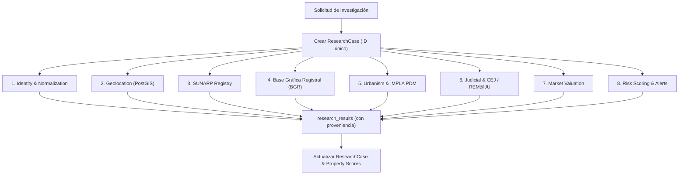

# Motor de Investigación (Research Engine) — Due Diligence Automatizado

## 1. Visión del Motor

El **Research Engine** es el componente central de Land Intelligence que transforma un simple anuncio inmobiliario en un **expediente integral de due diligence territorial**.

Cuando el usuario hace clic en **[INVESTIGAR]** en el panel o se dispara una orden vía API (`POST /api/v1/properties/:id/research`), el motor crea un `ResearchCase` y programa automáticamente **8 tareas especializadas** que se ejecutan en segundo plano.

---

## 2. Las 8 Tareas de Investigación

> **Nota de implementación (T3.9)**: `ResearchService.createResearch` crea las 8
> tareas con `priority='high'` para `identity` y `priority='medium'` para el
> resto (enum `task_priority`: `critical | high | medium | low`). La "prioridad"
> indicada en cada tarea de esta sección es la **criticidad objetivo** de diseño,
> aún no reflejada en la asignación automática.



### Tarea 1: Identidad y Normalización (`identity`)
- **Objetivo**: Limpiar datos textuales, calcular `content_hash`, detectar número de teléfono de contacto y normalizar precios a USD y PEN.
- **Entrada**: Datos crudos de la publicación.
- **Salida**: Inmueble enriquecido y deduplicado.
- **Prioridad**: `critical`.

### Tarea 2: Geolocalización & PostGIS (`geolocation`)
- **Objetivo**: Extraer indicios de ubicación (dirección, distrito real, referencias, coordenadas GPS si existen) y convertirlos en un punto espacial `geometry(Point, 4326)` en la tabla `property_geometries`.
- **Entrada**: Título, descripción, ubicación reportada por la plataforma y datos de OCR.
- **Salida**: Coordenadas validadas, distrito real verificado y polígono aproximado.
- **Prioridad**: `critical`.

### Tarea 3: Verificación Registral SUNARP (`registry`)
- **Objetivo**: Búsqueda en el índice de predios de SUNARP (Zona Registral N° XII - Sede Arequipa) para localizar la partida electrónica, titular registral y verificar si existen cargas o gravámenes inscritos.
- **Entrada**: DNI/RUC del vendedor, nombre del titular o número de partida si fue mencionado en el anuncio.
- **Salida**: Registro en `registry_properties`, `registry_owners` y `registry_charges`.
- **Prioridad**: `high`.

### Tarea 4: Base Gráfica Registral (`bgr`)
- **Objetivo**: Consultar la cartografía registral de SUNARP para verificar la existencia del polígono del predio en la base gráfica y descartar superposiciones de partidas o linderos superpuestos.
- **Entrada**: Coordenadas geográficas y partida electrónica.
- **Salida**: Polígono oficial SUNARP y reporte de superposición.
- **Prioridad**: `high`.

### Tarea 5: Urbanismo & Zonificación IMPLA / PDM (`urbanism`)
- **Objetivo**: Cruzar la ubicación espacial del inmueble con las capas cartográficas del Plan de Desarrollo Metropolitano (PDM) de Arequipa y el Instituto Municipal de Planeamiento (IMPLA).
- **Entrada**: Coordenadas PostGIS.
- **Salida**: Zonificación oficial (RDM, RDA, CZ, ZRE, Agrícola, etc.), retiros reglamentarios, altura máxima de edificación y usos compatibles.
- **Prioridad**: `medium`.

### Tarea 6: Verificación Judicial & CEJ (`judicial`)
- **Objetivo**: Consultar la plataforma de Consulta de Expedientes Judiciales (CEJ) de la Corte Superior de Justicia de Arequipa y la plataforma REM@JU para verificar si el predio o sus propietarios tienen litigios por usurpación, desalojo, mejor derecho de propiedad o remates judiciales activos.
- **Entrada**: Nombres de titulares registrales y dirección del predio.
- **Salida**: Registros en `judicial_cases` y `judicial_events`.
- **Prioridad**: `high`.
- **Nota REM@JU (Fase 4, T4.1 discovery)**: el portal (`remaju.pj.gob.pe`) es
  JSF/PrimeFaces detrás de Akamai. La **información pública** (home: tipo de
  convocatoria, ubicación, fechas, ids `convocatoria`/`remate`; detalle con
  partida registral/expediente/tasación) es accesible **sin autenticación**, pero
  el listado/detalle se sirve por **AJAX con ViewState** (sin URL GET estable).
  La participación/inscripción exige **login + CAPTCHA** → nunca automatizar
  (ver `docs/REMATE_JUDICIAL.md`). El conector consumirá solo la vía pública y
  delegará a **acción manual** (`manual_actions`) cualquier paso que exija
  CAPTCHA/login.
- **Implementación (Fase 4, T4.6)**: la tarea `judicial` la ejecuta ahora el
  orquestador (`executeRemajuTask`) contra el conector REM@JU real (registrado en
  `index.ts`): busca el carrusel público por distrito, empareja contra la partida
  registral/dirección de la property (`remaju-research.ts` + `remaju-link.ts`) y:
  - hard match por partida → resultado `confidence: 'high'` + `completed`;
  - solo candidatos débiles (distrito) → resultado `low` y la tarea pasa a
    `requires_manual_action` con `manual_action` (`kind: 'captcha'`) para que un
    operador capture el aviso (PDF) vía `/api/v1/manual-actions/.../complete`;
  - carrusel sin remates → `completed` con "Sin remates públicos".
  Provenance: `source: 'remaju'`, `dataType: 'judicial'`, `verification:
  'reported'`, `parserVersion: 'remaju-research-v1'`.

### Tarea 7: Valuación y Comparables de Mercado (`market`)
- **Objetivo**: Analizar precios de terrenos en la misma zona o distrito dentro de un radio de 500m a 2km para calcular el valor promedio por m² y detectar si la publicación está bajo o sobre el precio de mercado.
- **Entrada**: Distrito, área en m², coordenadas y tipo de terreno.
- **Salida**: Registros en `market_comparables` y estimación en `market_prices`.
- **Prioridad**: `medium`.

### Tarea 8: Scoring de Riesgo & Alertas (`risk`)
- **Objetivo**: Consolidar los resultados de las 7 tareas previas y emitir una matriz de alertas automatizadas.
- **Alertas Típicas**:
  - *Discrepancia de área*: El anuncio afirma 500 m², pero la partida SUNARP indica 380 m².
  - *Riesgo de estafa*: El predio se ubica en zona de riesgo no mitigable según el PDM (torrenteras, quebradas volcánicas).
  - *Propiedad estatal*: El predio intersecta con terrenos inscritos a nombre del Estado (SBN/COFOPRI).
  - *Oportunidad de precio*: Precio por m² 35% inferior a la media del distrito.
- **Prioridad**: `critical`.

---

## 3. Manejo de Acciones Manuales (`requires_manual_action`) — Fase 3 / T3.4

No todas las fuentes en el Perú están 100% digitalizadas o libres de CAPTCHAs. Cuando un conector no puede resolver automáticamente una consulta (ej. requiere comprar una copia literal en SPRL o resolver un captcha complejo de SUNARP), la tarea cambia a estado:

`task.status = 'requires_manual_action'`

y se crea **un registro en la tabla `manual_actions`** con los datos que un analista humano necesita para intervenir.

### Campos de `manual_actions`

| Campo | Propósito |
|---|---|
| `research_task_id` (FK) | Tarea que quedó a la espera de intervención |
| `property_id` (FK) | Inmueble relacionado |
| `action_kind` | Motivo: `captcha`, `login`, `payment`, `user_action`, `other` |
| `status` | `requested` → `completed` / `cancelled` |
| `instructions` | Instrucciones concretas para el analista |
| `url` | URL de la fuente donde intervenir |
| `source` | Origen (`sourceId` del conector o `system`) |
| `requested_at` | Cuándo se solicitó |
| `completed_at` / `completed_by` | Cuándo y quién resolvió |
| `result` (jsonb) | Dato/evidencia ingresado por el analista |

### Servicio (`server/src/domain/research/manual-action.service.ts`)

- **`requestManualAction`**: idempotente por tarea (una acción `requested`
  abierta se reutiliza en vez de duplicarse). Se invoca automáticamente desde:
  - `ResearchOrchestrator.executeConnectorTask` cuando el conector declara
    `requires_manual_action` o `requires_auth` (auth → `login`, resto →
    `user_action`; `source = sourceId`).
  - La ruta de geolocalización sin dirección geocodificable (`source = 'system'`).
  - `geocoding.worker.ts` cuando la tarea accidentalmente queda en
    `requires_manual_action` (fallback de seguridad, `source = 'system'`).
- **`completeManualAction`**: fija `completed_at`/`completed_by`/`result`,
  inserta una fila en `research_results` (`source='manual'`,
  `sourceUrl=action.url`, `verification='verified'`, `confidence='high'`,
  `parserVersion='manual-v1'`, `metadata={manualActionId, externalSource}`),
  audita `manual_result_entered`, transiciona la tarea
  `requires_manual_action → completed` (borde nuevo en
  `task-lifecycle.ts`) con `resultReference` y refresca el avance del caso.
- **`cancelManualAction`**: cierra la solicitud sin resultado.

> Política anti-datos-inventados: el mecanismo **no** produce resultados
> automáticos; un analista humano introduce el dato real y éste queda marcado
> como `verified` con proveniencia `manual`.

---

## 4. Ciclo de Vida del ResearchCase (Fase 3 / T3.1)

El estado del caso se modela en `server/src/domain/research/lifecycle.ts` y vive en la columna `research_cases.status` (enum PostgreSQL `research_status`).

```text
created ──▶ queued ──▶ running ──┬──▶ completed
   │          │          │        ├──▶ partial
   └──────────┴──────────┘        └──▶ failed
                                 (cancelled disponible)
```

Estados:

- **created**: el caso se creó junto con sus 8 tareas; aún no se encoló nada.
- **queued**: al menos un job (geocoding o research) fue encolado en BullMQ.
  Si Redis está caído no se encola nada y el caso permanece en `created`.
- **running**: el worker de research toma el caso y registra `startedAt`.
- **completed**: todas las tareas llegaron a estado terminal y ninguna falló.
- **partial**: todas las tareas terminaron, pero al menos una falló (una fuente
  caída no deja el caso colgado en `running`).
- **failed**: estado terminal definido para un error no recuperable del caso.
  **Nota (T3.9)**: `updateCaseProgress()` hoy sólo produce `completed` o
  `partial`; ningún camino automatizado transiciona a `failed` todavía.
- **cancelled**: reservado para cancelación explícita.

Reglas de integridad:

- Las transiciones se validan con `assertCaseTransition()` y se aplican con
  `transitionCase()` mediante un `UPDATE ... WHERE status = <estado actual>`,
  por lo que son **race-safe** y **atómicas**.
- Los estados terminales (`completed`, `partial`, `failed`, `cancelled`) son
  **inmutables**: el worker omite casos ya terminados (idempotencia ante
  re-entregas de BullMQ).
- `startedAt` se fija al entrar en `running`; `completedAt` y `summary` al
  alcanzar un estado terminal.
- `errorCount` = número de tareas `failed`.
- `warningCount` = tareas `requires_manual_action` + `blocked` + `unavailable`.
- `pending` se conserva como estado legacy de filas anteriores a T3.1; las
  nuevas cases nacen en `created`.

---

## 5. Ciclo de Vida del ResearchTask (Fase 3 / T3.2)

El estado de cada tarea se modela en `server/src/domain/research/task-lifecycle.ts`
y vive en la columna `research_tasks.status` (enum PostgreSQL `task_status`).

```text
               ┌──▶ completed (éxito)
               ├──▶ failed (error de la fuente / timeout)
pending ──▶ running ──▶ requires_manual_action (pausa → running/completed)
   │           ├──▶ unavailable (fuente externa no accesible)
   │           ├──▶ blocked (bloqueado por otra tarea/estado)
   │           └──▶ skipped (no aplica / ya resuelto por otro camino)
   │
   └──▶ completed / failed / requires_manual_action /
        unavailable / blocked / skipped (sin pasar por running)
```

Estados (enum `task_status`):

- **pending**: creada junto con el caso; a la espera de un worker.
- **running**: un worker la tomó en ejecución (`startedAt`).
- **completed**: resultado obtenido y registrado (con `resultReference` cuando
  aplica). Estado **inmutable**.
- **failed**: el intento falló (p. ej. geolocalización sin resultados, fuente
  caída o timeout). **Nota (T3.9)**: no existe un timeout activo en el
  orquestador; el timeout de un conector llega como excepción y se registra aquí.
- **requires_manual_action**: el trabajo quedó pausado esperando acción humana
  (CAPTCHA, login, pago, dato manual). `requiresManualAction = true` con
  `manualActionDescription`. No se marca `completedAt` porque no terminó.
- **blocked**: bloqueada por una dependencia no disponible.
- **unavailable**: el conector externo es un stub o no está accesible
  (política anti-datos-inventados).
- **skipped**: no aplica o ya fue resuelta por otra ejecución (geolocalización
  idempotente). Estado **inmutable**.

Reglas de integridad:

- Las transiciones se validan con `assertTaskTransition()` y se aplican con
  `transitionTask()` mediante un `UPDATE ... WHERE status = <estado actual>`,
  por lo que son **race-safe** y **atómicas** (mismo patrón que el caso).
- **Inmutables**: `completed` y `skipped` nunca cambian.
- **Reintentables**: `failed`, `blocked`, `unavailable` y
  `requires_manual_action` pueden volver a `pending`/`running`
  (re-ejecución), lo que invalida `completedAt`, re-abre `startedAt` cuando
  aplica y **suma 1 a `retryCount`**. **Nota (T3.8)**: `maxRetries` se expone en
  el DTO pero **aún no se aplica** en `transitionTask`; no hay tope efectivo.
- `startedAt` se fija al entrar en `running`, o al alcanzar un estado final sin
  haber pasado por `running` (ventana de trabajo implícita). `completedAt` se
  fija al concluir el trabajo automatizado (nunca en `requires_manual_action`).
- `completed` limpia `error` y `requiresManualAction`; `requires_manual_action`
  activa automáticamente el flag `requiresManualAction`.
- **T3.4**: el borde directo `requires_manual_action → completed` cierra la tarea
  cuando un analista ingresa el resultado vía `completeManualAction`
  (ver §3).
- **Settled** (para decidir el estado del caso): `completed`, `failed`,
  `skipped`, `unavailable`, `blocked`, `requires_manual_action`. Cuando todas
  las tareas de un caso están settled, el caso puede terminar
  (`updateCaseProgress`, ver §4).
- DTO `ResearchTaskDTO` expone `retryCount`, `maxRetries` y `updatedAt`.

---

## 6. Orquestación de la Investigación y Aislamiento de Fallos (Fase 3 / T3.3)

La orquestación de la investigación se centraliza en `server/src/domain/research/orchestrator.ts` (`ResearchOrchestrator`), que coordina la ejecución de las tareas sobre una propiedad y garantiza la recolección de resultados en `research_results`.

```text
PROPERTY
   ↓
ResearchCase
   ↓
ResearchTasks
   ↓
BullMQ (colas 'research' y 'geocoding')
   ↓
Workers / Orchestrator
   ↓
ResearchResults
```

### Principios y Garantías

1. **Aislamiento de Fallos (Fault Isolation)**:
   - Cada tarea se ejecuta dentro de un bloque protegido (`try/catch` individual).
   - Si una fuente externa está caída (p. ej. error HTTP 500, timeout, `ECONNREFUSED` o fallo inesperado del conector), la excepción se captura, se registra un log estructurado y la tarea pasa a estado `failed` con su mensaje de error.
   - **Una fuente caída NO detiene la investigación**: el orquestador continúa ejecutando de inmediato las tareas restantes.

2. **Ejecución Parcial (Partial Execution)**:
   - Cuando todas las tareas del caso han finalizado su ciclo (`settled`), `updateCaseProgress()` evalúa los resultados:
     - Si no hay tareas fallidas (`errorCount === 0`), el caso transiciona a `completed`.
     - Si una o más tareas fallaron (`errorCount > 0`), el caso transiciona automáticamente a `partial`, con un resumen descriptivo (`Caso con ejecución parcial: X tarea(s) con error`).
     - El caso nunca queda suspendido en `running` indefinidamente.

3. **Proveniencia y Creación de `ResearchResults`** (endurecido en T3.5):
   - Cada resultado se persiste mediante la ruta única
     `recordResearchResult()` (`server/src/domain/research/result-provenance.ts`),
     que garantiza los 8 campos de provenance (ver §7).
   - `source`: identificador de la fuente (`system`, `openstreetmap`, `manual`,
     `sunarp`, etc.).
   - `source_url`: URL de origen de los datos cuando aplica.
   - `retrieved_at`: cuándo se obtuvo/ingresó el dato (default `now`).
   - `data_type`: tipo de datos (`identity`, `geolocation`, etc.).
   - `data`: estructura normalizada JSON.
   - `raw_data`: payload crudo de la fuente (snapshot del property para
     `identity`; `null` cuando no existe fuente cruda).
   - `confidence`: nivel de confianza (`high`, `medium`, `low`, `unknown`).
   - `verification`: estado de verificación (`inferred`, `verified`, `reported`,
     `conflicting`, `unknown`).
   - `parser_version`: versión del parser que procesó la información.
   - El ID del resultado se enlaza en `research_tasks.result_reference`.

4. **Multi-Task Results Querying**:
   - `ResearchService.getResults(researchCaseId)` utiliza `inArray(researchResults.researchTaskId, taskIds)` para recuperar los resultados de todas las tareas pertenecientes al caso de investigación, corrigiendo la limitación anterior que sólo consultaba la primera tarea.

5. **Idempotencia**:
   - Casos ya terminales (`completed`, `partial`, `failed`, `cancelled`) son ignorados sin error ante re-entregas de jobs en BullMQ.
   - Tareas ya asentadas (`settled`) se omiten para evitar trabajo redundante o duplicación de datos.

---

## 7. Provenance de Resultados (Fase 3 / T3.5)

Todo `research_results` se escribe a través de una **ruta única**
(`recordResearchResult` en `server/src/domain/research/result-provenance.ts`),
que normaliza y garantiza los campos de provenance para que ningún productor
los omita:

| Campo | Semántica | Default |
|---|---|---|
| `source` | Identificador de la fuente/conector | (requerido) |
| `source_url` | URL del dato original | `null` |
| `retrieved_at` | Cuándo se obtuvo/ingresó el dato | `now` |
| `data_type` | Tipo de dato (`identity`, `geolocation`, `registry`, …) | `unknown` |
| `data` | Estructura normalizada (parser) | `{}` |
| `raw_data` | Payload crudo de la fuente | `null` |
| `confidence` | `high` \| `medium` \| `low` \| `unknown` | `unknown` |
| `verification` | `reported` \| `inferred` \| `verified` \| `conflicting` \| `unknown` | `reported` |
| `parser_version` | Versión del parser | `v1` |
| `metadata` | Contexto adicional (ej. `manualActionId`) | `null` |

Productores cubiertos: `executeIdentityTask`, `executeGeolocationTask`
(verificado y vía OSM), `executeConnectorTask`,
`geocoding.worker.markGeolocationTask` y
`ManualActionService.completeManualAction`.

El DTO `ResearchResultDTO` expone `source`, `sourceUrl`, `retrievedAt`, `data`,
`rawData`, `confidence`, `verification`, `parserVersion` y `metadata`.

## 8. Cobertura de Pruebas (Fase 3 / T3.8)

`server/tests/research-flows.test.ts` ejecuta el código real
(orchestrator / lifecycle / service) contra una base in-memory que evalúa los
`WHERE` de Drizzle, cubriendo los flujos del plan:

| Escenario | Qué valida | Resultado esperado del caso |
|---|---|---|
| Full research | 8 tareas, sin fallos | `completed` (8/8, 6 warnings) |
| Partial research | una tarea falla, el resto completa | `partial`, `errorCount=1` |
| Failed task | error de fuente persistido en la tarea | `partial` |
| Unavailable source | conector stub | `unavailable` (warning, no error) |
| Retry | `failed → running` | `retryCount+1`, `completedAt=null` |
| Duplicate research | dos `createResearch` | 2 casos independientes, 8 tareas c/u |
| Manual action | geolocalización sin dirección | tarea `requires_manual_action` + fila en `manual_actions` |
| Timeout | fuente expira (`ETIMEDOUT`) | `partial`, las demás tareas continúan |

### Limitaciones conocidas (reveladas por T3.8)

- `createResearch` **no deduplica** investigaciones activas del mismo inmueble.
- `transitionTask` **no aplica `maxRetries`** (el tope sólo se expone en el DTO).
- **No hay timeout activo** en el orquestador; un timeout del conector llega
  como error y se registra como tarea `failed`.
- `updateCaseProgress` **nunca marca un caso como `failed`**: usa `partial`.


